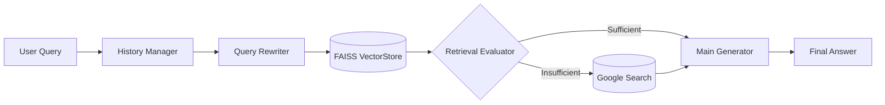

<p align="center">
  
  
  
  
  
</p>

<h1 align="center">💊 PharmaRAG-VN</h1>

<p align="center">
  <strong>Trợ lý Dược sĩ Lâm sàng AI — Hệ thống RAG tra cứu Dược thư Quốc gia Việt Nam</strong>
</p>

<p align="center">
  <em>Hệ thống hỏi đáp thông minh sử dụng kiến trúc Adaptive RAG kết hợp điều phối đa mô hình (Multi-LLM Orchestration), hỗ trợ tra cứu chuyên sâu về thuốc dựa trên nguồn dữ liệu chính thống — Dược thư Quốc gia Việt Nam 2018.</em>
</p>

---

## 📋 Mục lục

- [Tổng quan](#-tổng-quan)
- [Tính năng nổi bật](#-tính-năng-nổi-bật)
- [Kiến trúc hệ thống](#-kiến-trúc-hệ-thống)
- [Công nghệ sử dụng](#-công-nghệ-sử-dụng)
- [Cài đặt](#-cài-đặt)
- [Sử dụng](#-sử-dụng)
- [Cấu trúc dự án](#-cấu-trúc-dự-án)
- [Mô hình LLM](#-mô-hình-llm)
- [Dữ liệu nguồn](#-dữ-liệu-nguồn)
- [Hạn chế và hướng phát triển](#-hạn-chế-và-hướng-phát-triển)
- [Giấy phép](#-giấy-phép)

---

## 🔬 Tổng quan

**PharmaRAG-VN** là hệ thống **Retrieval-Augmented Generation (RAG)** thông minh, đóng vai trò **dược sĩ lâm sàng AI**, hỗ trợ người dùng tra cứu và hỏi đáp chuyên sâu về:

- 💊 **Thành phần & dược lý** của các dược chất
- ✅ **Chỉ định & chống chỉ định** sử dụng thuốc
- ⚠️ **Tác dụng phụ & tương tác thuốc**
- 📋 **Liều lượng, cách dùng** cho từng đối tượng bệnh nhân
- 🏥 **Quy chế kê đơn** và các hướng dẫn lâm sàng

Nguồn dữ liệu cốt lõi (Ground Truth) là **"Dược thư Quốc gia Việt Nam 2018"** — bộ tài liệu chính thống do Bộ Y tế ban hành, bao gồm khoảng **700 chuyên luận dược chất** được cấu trúc hóa nghiêm ngặt.

---

## ✨ Tính năng nổi bật

| Tính năng | Mô tả |
|---|---|
| 🤖 **Multi-LLM Orchestration** | Điều phối 3 mô hình LLM chuyên biệt cho từng tác vụ, tối ưu hiệu năng và chi phí |
| 🔄 **Query Rewriting** | Tự động chuẩn hóa câu hỏi thành truy vấn độc lập, tối ưu cho vector search |
| 🧠 **Adaptive RAG** | Tự đánh giá chất lượng retrieval, kích hoạt Web Search khi dữ liệu nội bộ không đủ |
| 📚 **Context Window Management** | Quản lý lịch sử thông minh: giữ 3 lượt gần nhất + tóm tắt lịch sử cũ |
| 🌐 **Fallback Web Search** | Tìm kiếm bổ sung qua Google (Serper API + Trafilatura) khi cần thiết |
| 🎨 **Modern Chat UI** | Giao diện web đẹp mắt kiểu ChatGPT với khả năng xem context đã truy xuất |
| 🖥️ **CLI Mode** | Hỗ trợ chạy trực tiếp trên terminal cho mục đích phát triển và debug |

---

## 🏗️ Kiến trúc hệ thống





### Luồng xử lý chi tiết

1. **Tiếp nhận & quản lý lịch sử** — Tách lịch sử thành phần tóm tắt (cũ) và 3 lượt gần nhất (nguyên bản)
2. **Chuẩn hóa truy vấn (Query Rewriting)** — Sử dụng `Llama-3.1-8B-Instant` viết lại câu hỏi thành truy vấn độc lập
3. **Truy xuất tài liệu (Retrieval)** — Tìm kiếm Top 3 đoạn tương đồng nhất từ FAISS VectorStore
4. **Đánh giá ngữ cảnh (Context Evaluation)** — `Qwen3-32B` phân tích: `SUFFICIENT` hoặc `INSUFFICIENT`
5. **Bổ sung nguồn web (Fallback)** — Kích hoạt Google Search nếu dữ liệu nội bộ không đủ
6. **Sinh câu trả lời (Generation)** — `Llama-3.3-70B-Versatile` tổng hợp tất cả ngữ cảnh để trả lời

---

## 🛠️ Công nghệ sử dụng

| Thành phần | Công nghệ |
|---|---|
| **Framework** | [LangChain](https://www.langchain.com/) |
| **LLM Provider** | [Groq](https://groq.com/) (Llama 3.3 70B, Llama 3.1 8B, Qwen3 32B) |
| **Embedding** | [OpenAI](https://openai.com/) `text-embedding-3-large` |
| **Vector Store** | [FAISS](https://github.com/facebookresearch/faiss) (Facebook AI Similarity Search) |
| **Web Server** | [Flask](https://flask.palletsprojects.com/) |
| **Web Search** | [Serper API](https://serper.dev/) (Google Search) |
| **Web Scraping** | [Trafilatura](https://trafilatura.readthedocs.io/) |
| **Frontend** | HTML/CSS/JavaScript (Dark theme, responsive) |
| **PDF Processing** | [marker-pdf](https://github.com/VikParuchuri/marker) |

---

## 🚀 Cài đặt

### Yêu cầu hệ thống

- Python 3.10+
- Các API key: OpenAI, Groq, Serper

### Các bước cài đặt

**1. Clone repository**

```bash
git clone https://github.com/Anhtu12022004/Vietnam-National-Pharmacopoeia-Agent.git
cd Vietnam-National-Pharmacopoeia-Agent
```

**2. Tạo virtual environment**

```bash
python -m venv venv

# Windows
venv\Scripts\activate

# macOS/Linux
source venv/bin/activate
```

**3. Cài đặt dependencies**

```bash
pip install flask langchain langchain-groq langchain-openai langchain-community faiss-cpu python-dotenv trafilatura requests
```

**4. Cấu hình biến môi trường**

Tạo file `.env` tại thư mục gốc:

```env
OPENAI_API_KEY=sk-your-openai-api-key
GROQ_API_KEY=gsk_your-groq-api-key
SERPER_API_KEY=your-serper-api-key
```

**5. Chuẩn bị dữ liệu Vector Store**

> ⚠️ FAISS index đã được build sẵn trong `Data/VectorStore/faiss_index/`. Nếu cần rebuild, sử dụng các notebook trong thư mục `notebook/`.

---

## 💡 Sử dụng

### Chế độ Web UI (khuyến nghị)

```bash
python app.py
```

Truy cập `http://localhost:5000` trên trình duyệt.

**Các tính năng UI:**
- 💬 Chat với giao diện giống ChatGPT
- 📖 Xem chi tiết context đã truy xuất (nội bộ + web)
- 🔖 Phân biệt nguồn: badge xanh (Dược thư) và badge vàng (Web Search)
- 🗑️ Xóa lịch sử chat để bắt đầu cuộc hội thoại mới
- 💡 Gợi ý câu hỏi mẫu trên trang chào mừng

### Chế độ CLI

```bash
python -m core.chat_engine
```

Gõ câu hỏi trực tiếp trên terminal. Nhập `exit`, `quit` hoặc `thoát` để thoát.

### Ví dụ câu hỏi

```
Paracetamol có chống chỉ định gì?
Liều dùng Amoxicillin cho trẻ em là bao nhiêu?
Tương tác thuốc giữa Warfarin và Aspirin?
Silymarin có tác dụng gì?
Hướng dẫn sử dụng thuốc cho người suy thận?
```

---

## 📁 Cấu trúc dự án

```
PharmaRAG-VN/
├── app.py                          # Flask web server (entry point)
├── .env                            # API keys (không commit lên git)
├── .gitignore
│
├── core/                           # 🧠 Package xử lý chính
│   ├── __init__.py                 # Export hàm ask()
│   ├── config.py                   # Khởi tạo Embeddings, VectorStore, LLM instances
│   ├── prompts.py                  # Tất cả Prompt Templates (Main, Summary, Rewrite, Eval)
│   ├── chains.py                   # Tạo LangChain chains từ prompts + LLMs
│   ├── chat_engine.py              # Hàm ask() chính — điều phối toàn bộ pipeline
│   └── retrieval.py                # Đánh giá retrieval + xây dựng web context
│
├── search/                         # 🌐 Package tìm kiếm web
│   ├── __init__.py                 # Export search_on_google()
│   └── google.py                   # Serper API + Trafilatura web scraping
│
├── templates/                      # 🎨 Frontend
│   └── index.html                  # Giao diện chat (HTML/CSS/JS, dark theme)
│
├── Data/                           # 📚 Dữ liệu
│   ├── duoc-thu-quoc-gia-viet-nam-2018.pdf   # PDF gốc Dược thư
│   ├── convert_pdf_to_markdown.ipynb          # Notebook chuyển PDF → Markdown
│   ├── Cac_Chuyen_Luan_Thuoc/     # ~700 chuyên luận dược chất (raw → normalized)
│   ├── Huong_Dan_Su_Dung/         # Hướng dẫn sử dụng chung
│   ├── Phu_Luc/                   # Phụ lục (pha thuốc tiêm, phân loại ATC)
│   ├── Clean/                     # Dữ liệu đã làm sạch (Markdown + CSV chunks)
│   └── VectorStore/               # FAISS index đã build
│       └── faiss_index/
│
├── notebook/                       # 📓 Jupyter Notebooks (phát triển & thử nghiệm)
│   ├── Chunking.ipynb             # Chia nhỏ tài liệu thành chunks
│   ├── Embedding.ipynb            # Tạo embeddings và lưu FAISS index
│   ├── Searching.ipynb            # Thử nghiệm tìm kiếm RAG
│   └── Chat.ipynb                 # Thử nghiệm vòng lặp chat
│
└── Docx/                          # 📄 Tài liệu kỹ thuật
    └── architecture_rag.md        # Báo cáo kiến trúc hệ thống chi tiết
```

---

## 🤖 Mô hình LLM

Hệ thống sử dụng chiến lược **Multi-LLM Orchestration** — phân rã tác vụ cho từng mô hình có kích thước phù hợp:

| Vai trò | Mô hình | Kích thước | Mục đích |
|---|---|---|---|
| ⚡ **Fast LLM** | `Llama-3.1-8B-Instant` | 8B | Chuẩn hóa truy vấn (Query Rewriting) — tốc độ cao, tiết kiệm token |
| 🔍 **Eval LLM** | `Qwen3-32B` | 32B | Đánh giá chất lượng retrieval — suy luận logic tốt, phân loại nhị phân |
| 🧠 **Main LLM** | `Llama-3.3-70B-Versatile` | 70B | Sinh câu trả lời chính — suy luận mạnh, hỗ trợ tiếng Việt tốt |

> Tất cả các mô hình đều được phục vụ qua **Groq API** với tốc độ inference cực nhanh nhờ phần cứng LPU.

---

## 📖 Dữ liệu nguồn

### Dược thư Quốc gia Việt Nam 2018

Bộ tài liệu được chia thành 2 cấu trúc chính:

**1. Các chuyên luận chung (General Guidelines)**
- Quy chế kê đơn thuốc
- Nguyên tắc sử dụng thuốc cho đối tượng đặc biệt (người cao tuổi, trẻ em, suy gan/thận)
- Bảng phân loại lâm sàng (Child-Pugh, GFR)

**2. Các chuyên luận thuốc (~700 dược chất)**

Mỗi dược chất được cấu trúc hóa theo 19 phần cố định:

| # | Nội dung |
|---|---|
| 1 | Tên chuyên luận (Việt hóa) |
| 2 | Tên chung quốc tế (INN) |
| 3 | Mã ATC |
| 4 | Loại thuốc |
| 5 | Dạng thuốc & hàm lượng |
| 6 | Dược lý & cơ chế tác dụng |
| 7 | Chỉ định |
| 8 | Chống chỉ định |
| 9 | Thận trọng |
| 10 | Thời kỳ mang thai |
| 11 | Thời kỳ cho con bú |
| 12 | Tác dụng không mong muốn (ADR) |
| 13 | Hướng dẫn xử trí ADR |
| 14 | Liều lượng & cách dùng |
| 15 | Tương tác thuốc |
| 16 | Độ ổn định & bảo quản |
| 17 | Tương kỵ |
| 18 | Quá liều & xử trí |
| 19 | Thông tin quy chế |

### Pipeline xử lý dữ liệu

```
PDF gốc → marker-pdf → Markdown → Chuẩn hóa headers → Chunking → OpenAI Embedding → FAISS Index
```

---

## ⚙️ Hạn chế và hướng phát triển

### Hạn chế hiện tại

| Vấn đề | Chi tiết |
|---|---|
| 🕐 **Độ trễ tuần tự** | Pipeline chạy sequential qua nhiều LLM API, gây latency khi kích hoạt Web Search |
| 🔲 **Đánh giá nhị phân** | Chỉ có `SUFFICIENT/INSUFFICIENT`, thiếu trạng thái `PARTIALLY_SUFFICIENT` |
| ☁️ **Phụ thuộc API** | Toàn bộ LLM chạy qua Groq/OpenAI API — phụ thuộc kết nối mạng |

### Hướng phát triển

- [ ] **Xử lý bất đồng bộ** — Chạy song song Retrieve + Summarize history
- [ ] **Semantic Cache** — Cache câu hỏi-trả lời theo cosine similarity, bypass pipeline khi trùng
- [ ] **Streaming Response** — Hiển thị câu trả lời theo thời gian thực (SSE/WebSocket)
- [ ] **Partially Sufficient** — Thêm trạng thái đánh giá trung gian cho retrieval
- [ ] **Data Masking** — Ẩn danh hóa thông tin nhạy cảm trước khi gửi qua API bên thứ ba
- [ ] **Expand Dataset** — Bổ sung thêm các nguồn dược liệu chính thống khác

---

## 📄 Giấy phép

Dự án này được phát triển cho mục đích nghiên cứu và học tập.

Dữ liệu Dược thư Quốc gia Việt Nam 2018 thuộc bản quyền của **Bộ Y tế Việt Nam**.

